# MRhub

MRhub is my capstone project, created to demonstrate a practical full-stack system for managing academic department requests and resources.

MRhub is a request, inventory, delivery, and budget management system built for academic department workflows. It demonstrates role-based approvals, per-item fulfillment, inventory traceability, department budgets, and in-app workflow notifications in a Laravel and React application.

## Highlights

- Role-based request workflow from submission through delivery and receipt confirmation
- Inventory management with stock-card history and quantity tracking
- Partial releases and partial item rejection support
- Department budgets with semester allocation, reservation, spending, and release tracking
- Custom request items with estimated unit prices
- In-app notifications for workflow and budget events
- Delivery receipt viewing and export to Excel, CSV, PDF, and printable HTML
- Responsive dashboards with sorting, filtering, pagination, charts, and dark mode
- Server-side validation, authorization middleware, and workflow guards

## Portfolio Preview

This capstone project is currently demonstrated through local screenshots rather than a public deployment. The screenshots below show the main role-based dashboards and workflows using seeded demo data.

### Login and Dashboards

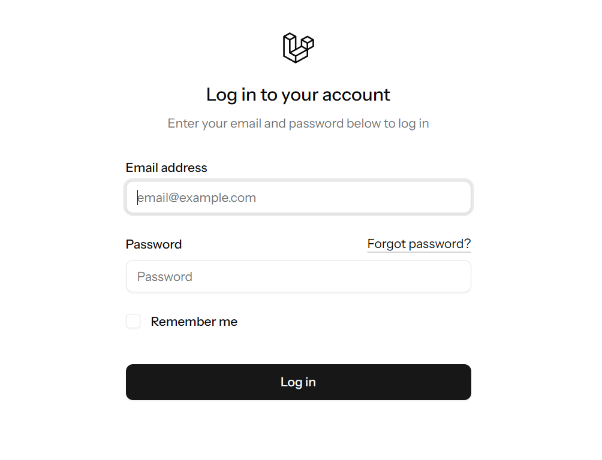

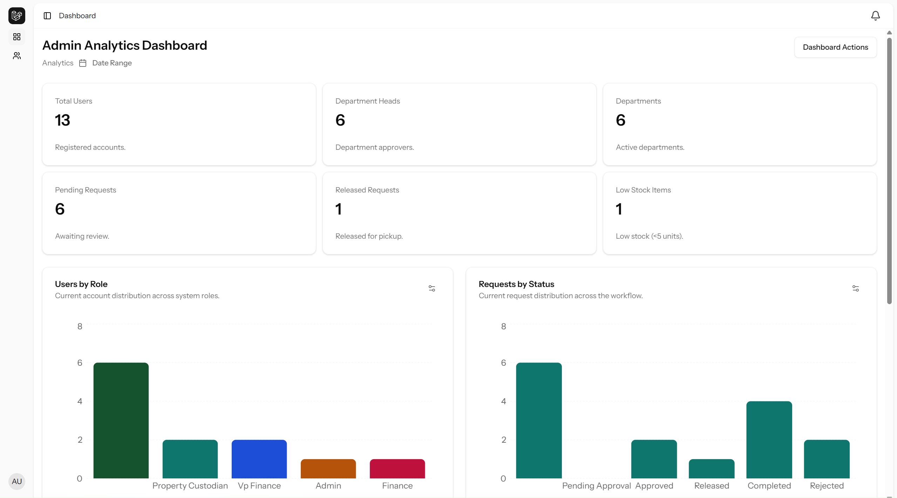

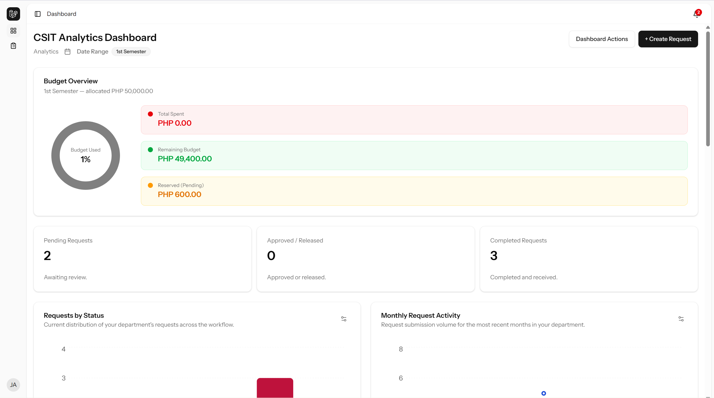

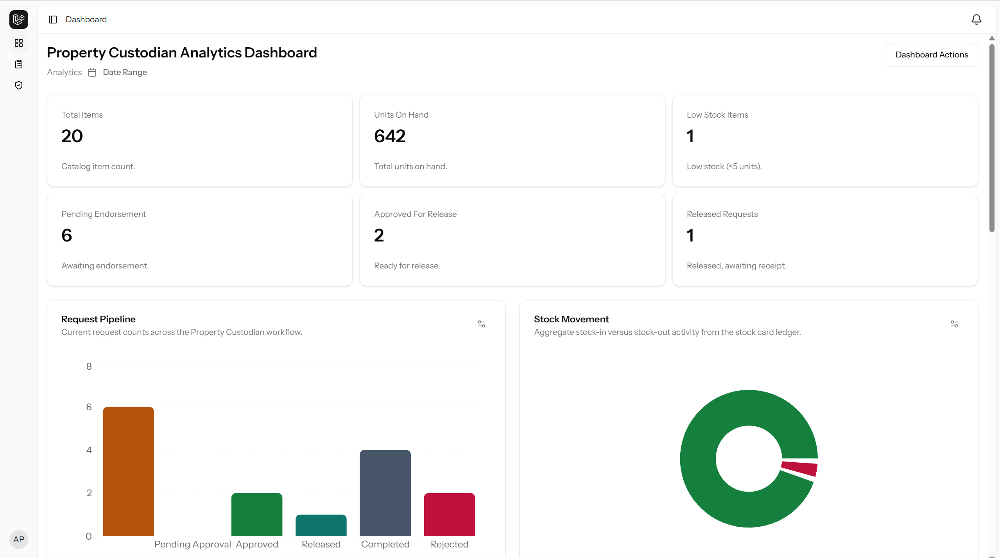

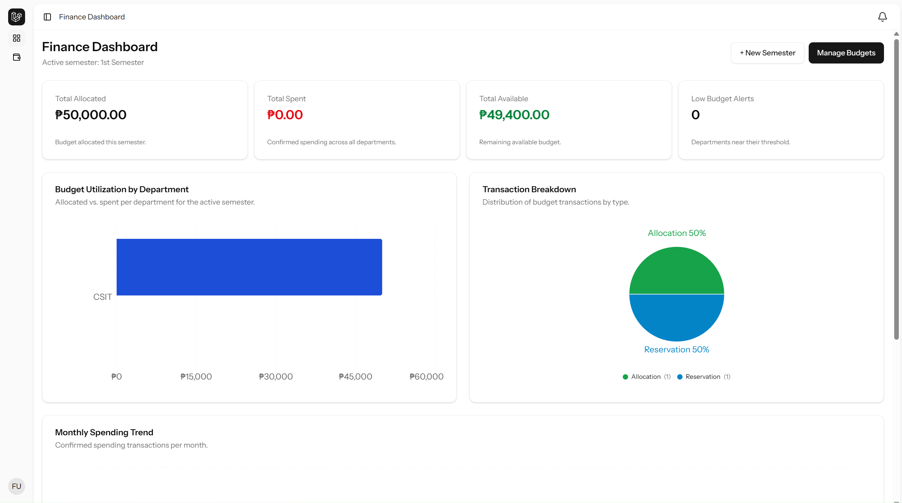

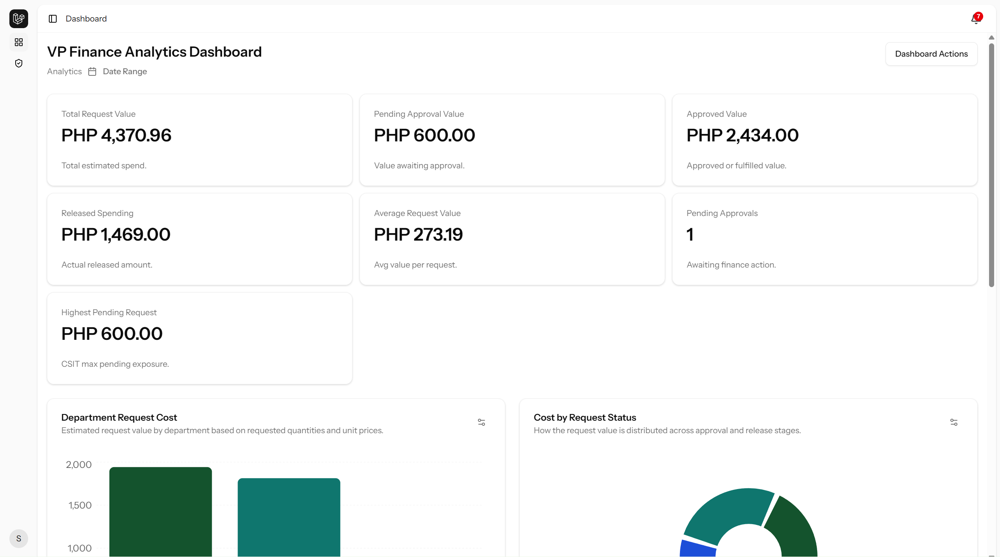

### Core Workflows

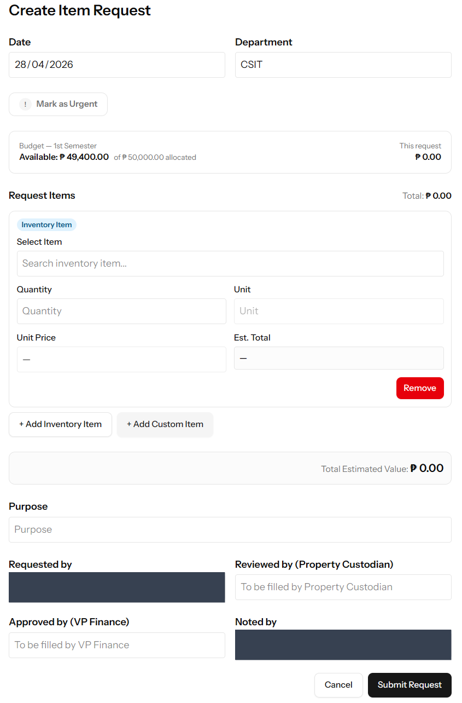

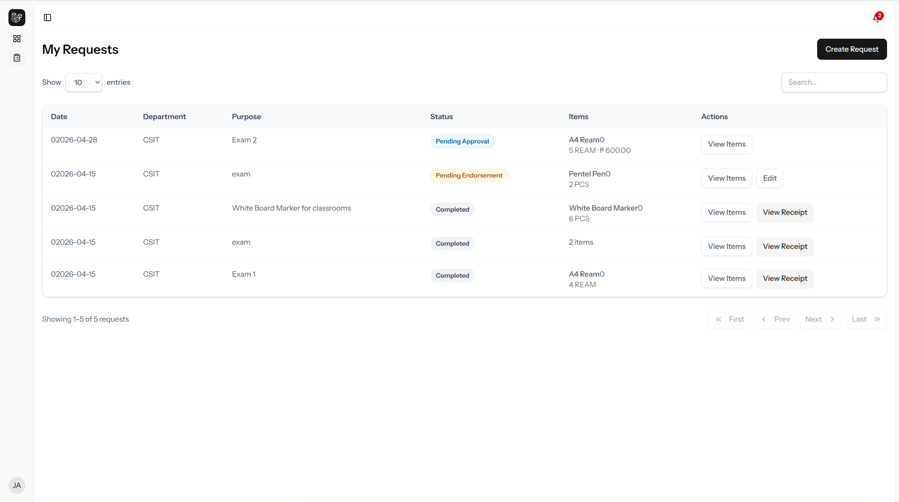

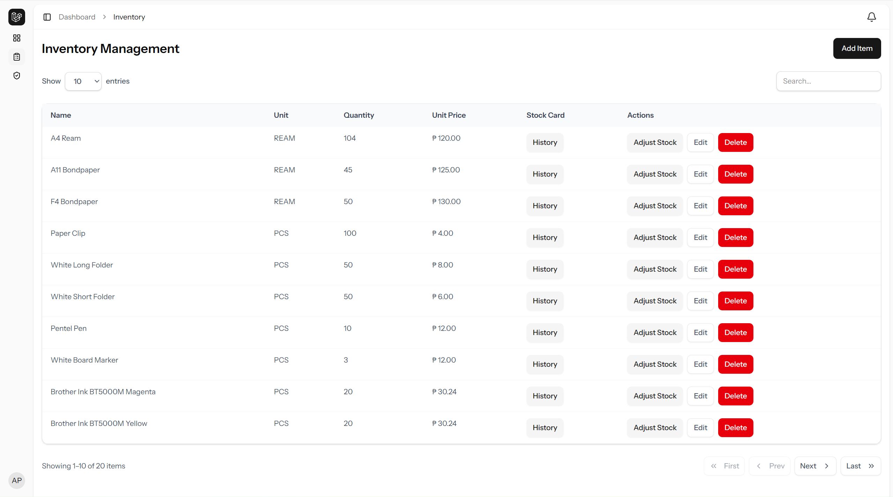

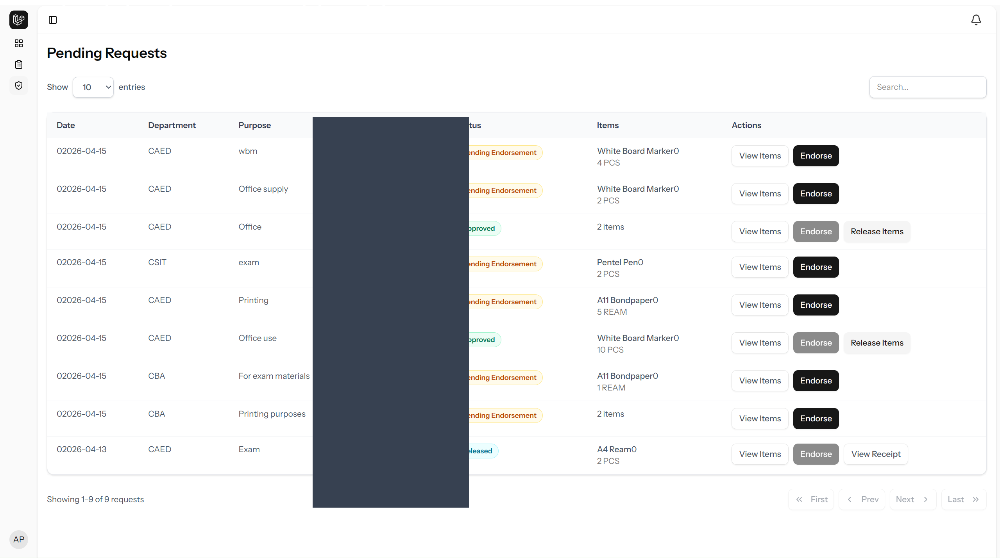

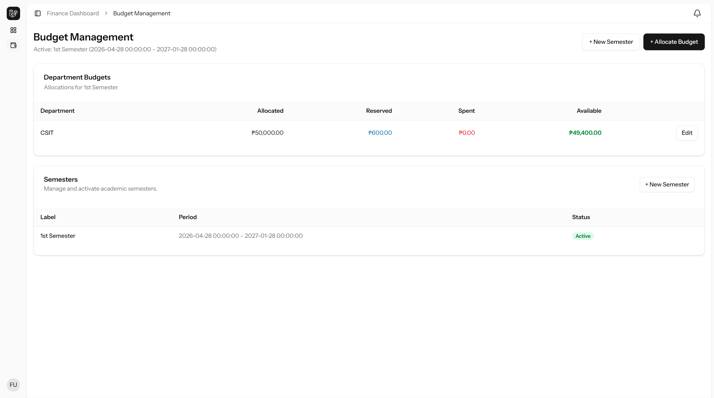

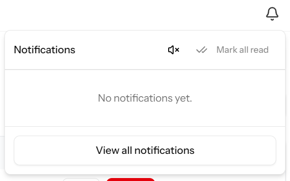

## Roles

| Role | Main responsibilities |
| --- | --- |
| **Admin** | Manage users and departments |
| **Department Head** | Create requests, monitor progress, and confirm receipt |
| **Property Custodian** | Manage inventory, endorse requests, and release items |
| **VP Finance** | Approve or reject endorsed requests |
| **Finance** | Manage semesters and department budget allocations |

## Request Workflow

1. A Department Head submits a request with one or more items.
2. The Property Custodian reviews and endorses the request.
3. The VP Finance approves or rejects the endorsed request.
4. The Property Custodian releases items. Releases may be split into multiple delivery receipt batches.
5. The Department Head confirms receipt after delivery.

Budget reservations and inventory changes are handled as part of the corresponding workflow operations.

## Technology

- **Backend:** Laravel 12, PHP 8.2+, Eloquent ORM
- **Frontend:** React 19, TypeScript, Inertia.js 2
- **UI:** Tailwind CSS 4, shadcn/ui, Radix UI, Lucide React
- **Tables and charts:** TanStack Table, Recharts
- **Exports:** SheetJS, jsPDF, jsPDF-AutoTable
- **Database:** SQLite for a simple local setup or MySQL
- **Authorization:** `spatie/laravel-permission`
- **Tooling:** Vite, ESLint, Prettier, PHPUnit, Playwright

## Requirements

- PHP 8.2 or newer
- Composer
- Node.js and npm
- SQLite or MySQL

## Local Setup

```bash
git clone <repository-url>
cd MRhub
composer install
npm install
```

Create the environment file and application key:

```bash
cp .env.example .env
php artisan key:generate
```

In PowerShell, use `Copy-Item .env.example .env` instead of `cp`.

The example environment uses SQLite. Create the database file if it does not already exist:

```bash
touch database/database.sqlite
```

In PowerShell, use `New-Item database/database.sqlite -ItemType File` instead of `touch`.

For MySQL, update `DB_CONNECTION`, `DB_HOST`, `DB_PORT`, `DB_DATABASE`, `DB_USERNAME`, and `DB_PASSWORD` in `.env` instead.

Run migrations and seed the demo data:

```bash
php artisan migrate --seed
```

The demo accounts are created only outside production. Their password comes from `SEEDER_DEFAULT_PASSWORD` in `.env`; change the example value before seeding a shared environment. Never commit `.env` or use demo credentials in production.

Start the application in separate terminals:

```bash
php artisan serve
npm run dev
```

Open `http://localhost:8000` in a browser.

## Demo Accounts

After seeding, these accounts are available for local evaluation. All use the value configured in `SEEDER_DEFAULT_PASSWORD`.

| Account | Role |
| --- | --- |
| `admin@gmail.com` | Admin |
| `custodian@gmail.com` | Property Custodian |
| `vpfinance@gmail.com` | VP Finance |
| `depthead@gmail.com` | Department Head |
| `finance@gmail.com` | Finance |

## Useful Commands

```bash
# Run the PHP test suite
php artisan test

# Check frontend types
npm run types

# Lint frontend files
npm run lint

# Check formatting
npm run format:check

# Build production frontend assets
npm run build
```

## Mobile Audit

The repository includes a Playwright audit for the main authenticated role flows:

```bash
npm run mobile:audit:install
php artisan db:seed --class=UserSeeder
php artisan serve --host=127.0.0.1 --port=8000
npm run mobile:audit
```

The audit builds the frontend, launches the mobile checks, and stores failure artifacts such as screenshots, traces, videos, and the HTML report. The same audit is configured to run in GitHub Actions.

## Project Layout

```text
app/
  Http/Controllers/       HTTP endpoints grouped by role
  Models/                 Eloquent domain models
  Services/               Business services such as budget management
  Support/                Workflow notification helpers
resources/js/
  pages/                  Inertia pages grouped by role
  components/             Shared React components
  lib/                    Frontend utilities and document exports
routes/                   Web, authentication, settings, and console routes
database/
  migrations/             Database schema
  seeders/                Roles, departments, and local demo accounts
tests/
  Feature/                HTTP and workflow behavior tests
  Unit/                   Unit tests
```

## Security Notes

- Production skips the demo user seeder.
- Demo passwords are supplied through the environment, not stored in source code.
- Role middleware and server-side authorization protect role-specific routes.
- Request, budget, inventory, and delivery operations validate workflow state before changing data.
- Keep `APP_DEBUG=false` and use strong, private credentials in any deployed environment.

## License

This project is licensed under the [MIT License](LICENSE).
